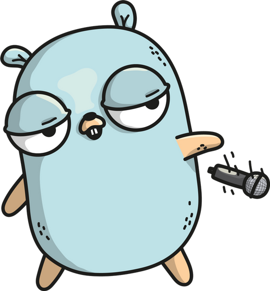

# Golang studies 

## Create a module

1. Short topics introducing:
   1. Functions
   2. Error handling
   3. Arrays
   4. Maps
   5. Unit testing
   6. Compiling

## RESTful API with Gin

1. Basic of writing a RESTful web service API with Gin web framework

## Generics intro with Golang

With generics, you can declare and use functions or types thar are written to work with any of a set of types provided by calling code.